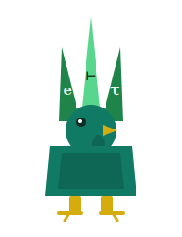

# HenQL

<p align="center">
  
</p>

> *La gallina che fa solo domande sensate — perché il tipo garantisce che la risposta esiste.*

Typed PromQL DSL in Agda — `Expr M τ` indicizzato per tipo, pretty-printer verso PromQL. Parametrico sul modello semantico di Prometea.

---

## Il problema

In PromQL puoi scrivere `rate(http_requests_total[5m])` e ottenere un instant vector. Puoi anche scrivere `rate(1.5)` — verrà rifiutato a runtime, non a compile time. HenQL porta il controllo dei tipi al momento della scrittura: se `rate` si aspetta un `RangeVector`, Agda non ti lascia passare uno `Scalar`. Il typechecker è il tuo linter PromQL.

---

## Come funziona

Un'espressione HenQL è un GADT indicizzato per `PromType`, parametrico sul `Model`:

```agda
data Expr (M : Model) : PromType → Set where
  scalar : String                               → Expr M Scalar
  metric : String                               → Expr M InstantVector
  range  : String → ℕ                          → Expr M RangeVector
  rate   : Expr M RangeVector                  → Expr M InstantVector
  sumBy  : List String → Expr M InstantVector  → Expr M InstantVector
```

Il parametro `M : Model` è phantom: non appare nei costruttori, ma impedisce di mescolare espressioni di modelli semanticamente distinti. Il parametro `τ : PromType` è il tipo dell'indice — il typechecker di Agda verifica che ogni composizione sia legittima:

```agda
-- ✓ compila: rate vuole un RangeVector
legittima : Expr M InstantVector
legittima = rate (range "http_requests_total" 5)

-- ✗ non compila: rate non accetta uno Scalar
--   assurda = rate (scalar "1.5")
--   Expected: Expr M RangeVector
--   Got:      Expr M Scalar
```

Il pretty-printer produce PromQL valido:

```agda
prettyExpr : {M : Model} {τ : PromType} → Expr M τ → String

prettyExpr (range "http_requests_total" 5)
-- → "http_requests_total[5m]"

prettyExpr (rate (range "http_requests_total" 5))
-- → "rate(http_requests_total[5m])"

prettyExpr (sumBy ("job" ∷ []) (rate (range "http_requests_total" 5)))
-- → "sum by (job) (rate(http_requests_total[5m]))"
```

---

## La metafora

La gallina HenQL non chioccia a caso. Sa che `rate` ha bisogno di una finestra, e che una finestra non è uno scalare. Ogni domanda che fa è **tipata**: prima di chiocciare, controlla che la risposta abbia senso.

| HenQL             | PromQL / Agda                                  |
|-------------------|------------------------------------------------|
| `Expr M τ`        | un'espressione di tipo `τ` sotto il modello `M`|
| `scalar`          | letterale numerico (`1.5`, `0`)                |
| `metric`          | selettore di metrica (`http_requests_total`)   |
| `range`           | finestra temporale (`[5m]`)                    |
| `rate`            | tasso di incremento su una finestra            |
| `sumBy`           | aggregazione per etichette                     |
| `prettyExpr`      | il traduttore verso PromQL                     |
| il parametro `M`  | il modello semantico (da Prometea)             |
| `τ` nell'indice   | la prova che la query ha senso                 |
| chiocciare        | emettere la stringa PromQL finale              |

---

## Come libreria

```nix
# flake.nix del tuo progetto
inputs.henql.url = "github:avit-io/HenQL";
inputs.henql.inputs.nixpkgs.follows = "nixpkgs";
inputs.henql.inputs.piforge.follows = "piforge";

devShells.x86_64-linux.default =
  inputs.henql.lib.mkShell {
    pkgs = nixpkgs.legacyPackages.x86_64-linux;
  };
```

```
# mio-progetto.agda-lib
name: mio-progetto
include: .
depend: standard-library prometea henql
```

```agda
open import Prometea.Core
open import HenQL.Syntax
open import HenQL.Print

myModel : Model
myModel = record { Time = ℕ ; Val = Float ; Series = String }

query : Expr myModel InstantVector
query = sumBy ("job" ∷ "instance" ∷ [])
          (rate (range "http_requests_errors_total" 5))

_ : prettyExpr query ≡ "sum by (job, instance) (rate(http_requests_errors_total[5m]))"
_ = refl
```

### Come sviluppatore di HenQL

```bash
git clone https://github.com/avit-io/HenQL
cd HenQL
nix develop              # Agda 2.8.0 + stdlib 2.3 + prometea in scope
agda HenQL/Print.agda    # typecheck completo
```

---

## Struttura del progetto

```
HenQL/
├── HenQL/
│   ├── Syntax.agda      # data Expr (M : Model) : PromType → Set
│   └── Print.agda       # prettyExpr : Expr M τ → String
├── henql.agda-lib       # depend: standard-library prometea
└── flake.nix            # packages.lib · lib.mkShell · devShells.default
```

Il flake espone:

| Output | Contenuto |
|---|---|
| `packages.lib` | la libreria Agda come derivazione Nix |
| `packages.default` | stesso di `lib` |
| `lib.mkShell` | devShell per i consumer con Agda + prometea + henql in scope |
| `devShells.default` | devShell per sviluppare HenQL stessa |

---

## Relazione con l'ecosistema

```
Prometea.Core          ← Model · PromType · Denote
     │
     │  open import Prometea.Core
     ▼
HenQL.Syntax           ← data Expr (M : Model) : PromType → Set
HenQL.Print            ← prettyExpr : Expr M τ → String
     │
     │  possibile consumer
     ▼
agdovana               ← regole SRE → alert PromQL → YAML
```

HenQL dipende da Prometea per `Model` e `PromType`. Non sa nulla di agdovana — è la direzione opposta che ha senso.

---

## Garanzie

- **Composizione tipata** — `rate` accetta solo `Expr M RangeVector`. Errori di composizione sono errori di compilazione.
- **Phantom type** — il parametro `M` garantisce che espressioni di modelli diversi non si mescolino, anche se hanno la stessa struttura sintattica.
- **`prettyExpr` è totale** — ogni `Expr M τ`, per qualsiasi `M` e `τ`, produce una stringa. Nessun caso parziale.
- **Zero runtime** — la validità della query è verificata staticamente. Nessun parser PromQL a runtime.

---

## Contribuire

Se trovi un costruttore PromQL che non è rappresentato, apri una issue con il titolo: *"la gallina non sa fare questa domanda"*.

---

## Licenza

MIT — fai le domande che vuoi.

---

*HenQL è la gallina che parla PromQL — ma solo quando ha qualcosa di sensato da dire.*
*Il tipo è la prova che la domanda ha senso. Senza tipo, silenzio.*

> *«Una query corretta non è quella che il server accetta —*
> *è quella che il typechecker approva prima ancora di inviarla.»*
